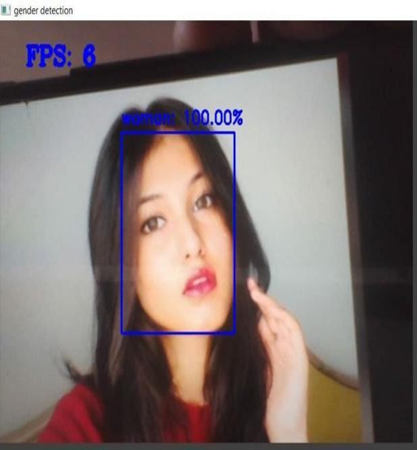

# Gender Detection

The Gender Detection is the project about the detecting the Human faces and classify them into two categories using the webcam of the computer

Here The Model can classify the faces into two categories 
<ol>
<li>Male</li>
<li>Female</li>
</ol> 

## Python packages
* numpy
* opencv-python
* tensorflow
* keras
* cvlib

Install the required packages by executing the following command.

`$ pip install -r requirements.txt`

**Note: Python 2.x is not supported** 

Make sure `pip` is linked to Python 3.x  (`pip -V` will display this info).

## Training
You can download the dataset I gathered from Google Images from this [link](https://github.com/arunponnusamy/gender-detection-keras/releases/download/v0.1/gender_dataset_face.zip) and train the network from scratch on your own if you are interested. You can add more images and play with the hyper parameters to experiment different ideas. 

### Additional packages
* scikit-learn
* matplotlib

Install them by typing `pip install scikit-learn matplotlib`

You can also use directly the detect_gender_webcam.py file by downloading the pre-trained model from the this <a href="https://drive.google.com/file/d/1N2W82oXIPi1ntk1D3SGRB-84uTEkMX5U/view?usp=sharing"> link </a> and put it in the same folder as all python file.
If you have an Nvidia GPU, then you can install `tensorflow-gpu` package. It will make things run a lot faster.

### Accuracy Plotting :

### Sample output :
 

